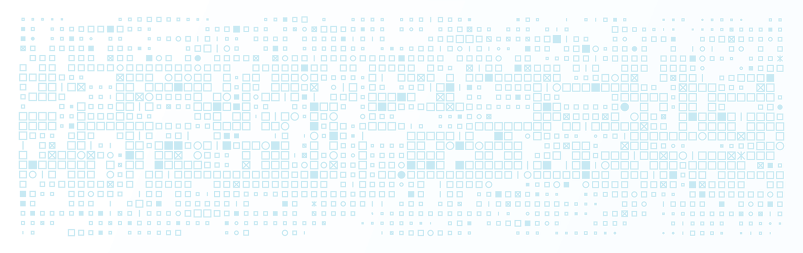

	

	

[Released under ](#license) by [@melissakinsey](https://github.com/melissakinsey).	
	
* [Description](#Description)
* [User Story](#User_Story)
* [Installation](#Installation)
* [Usage](#Usage)
* [Features](#Features)
* [Technical Specs](#Technical_Specs)
* [Tests](#Tests)
* [Lessons Learned](#Lessons_Learned)
* [Contributions](#Contributions)

	
# DESCRIPTION
asnfoaiw

## Project Repo 
[Readme Generator Repo](https://github.com/melissakinsey/readme-generator)
	
## GitHub Pages 
undefined
	
## Screencast
oweih
	
# USER STORY
*AS A* [type of user] *I WANT TO* [perform this task] *SO I CAN* [accomplish this goal]).
	
# INSTALLATION
undefined
	
# USAGE
aerfh
	
# FEATURES
owiefj
	
# TECHNICAL SPECS
node js
	
# TESTS
All
	
# LESSONS LEARNED 
Tons

# CONTRIBUTIONS
This was an individual project.
	
## IMAGE CREDITS
Header adapted from image by filo/iStockPhoto.  Badges created using Michael Currin's nifty [Badge Generator](https://michaelcurrin.github.io/badge-generator/#/repo).
	

## QUESTIONS
To ask questions or contribute project feedback, ping me @melissakinsey (GitHub), @KinseyMelissa (Twitter) or kinsey.melissa@gmail.com.
